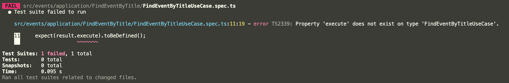
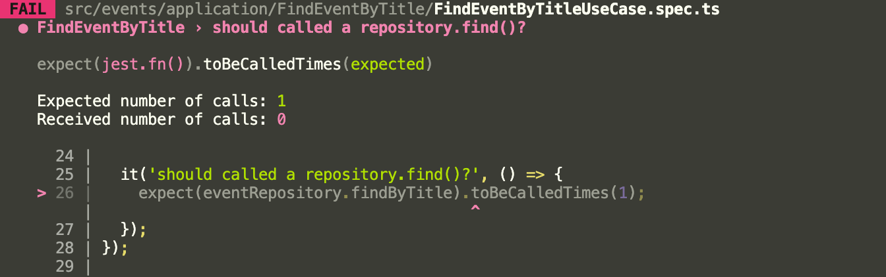

# 2022-08-04

## Query Parameter vs Body

> ddd 연습중에 Controller부분을 짜다가 생각이난 부분
난 요청이 오면 Body로 처리하는걸 선호해 대부분 Body로 처리했는데 둘중에 뭐가 나은지 궁금해서 검색해봄.  

The reasoning I've always used is that because POST, PUT, and PATCH presumably have payloads containing information that customers might consider proprietary, the best practice is to put all payloads for those methods in the request body, and not in the URL parms, because it's very likely that somewhere, somehow, URL text is being logged by your web server and you don't want customer data getting splattered as plain text into your log filesystem.

That potential exposure via the URL isn't an issue for GET or DELETE or any of the other REST operations.

Ref : [스땍-오버플로](https://stackoverflow.com/questions/25385559/rest-api-best-practices-args-in-query-string-vs-in-request-body)

> 한마디로 Mutation들은 Body쓰고 GET같은건 Query Parameter써라

## TDD 연습

Ref : [Node.js로 TDD하기](https://loy124.tistory.com/364)

> 구현 목록 생각 및 함수생성하기.. -> 단위테스트 작성하기 -> 실제 코드작성하기

`제목으로 이벤트들을 찾는 UseCase 만들기.`

1.execute 함수가 정의됐는지 확인한다.

```ts
describe('FindEventByTitle', () => {
  const title = '제목';

  let result: FindEventByTitleUseCase;
  let eventRepository: IEventRepository;

  it('should have a execute defined', () => {
    expect(result.execute).toBeDefined();
  });
});
```
그러면 당연히 밑에 execute가 없다고 테스트를 실패내버린다.


이제 구현해서 테스트를 통과시키자

```ts
describe('FindEventByTitle', () => {
  let result: FindEventByTitleUseCase;

  const title = '제목';

  beforeEach(() => {
    result = new FindEventByTitleUseCase();
  });

  it('should have a execute defined', () => {
    expect(result.execute).toBeDefined();
  });
});
```

```ts
@Injectable()
export class FindEventByTitleUseCase
  implements
    IUseCase<FindEventByTitleUseCaseRequest, FindEventByTitleUseCaseResponse>
{
  async execute(
    request?: FindEventByTitleUseCaseRequest,
  ): Promise<FindEventByTitleUseCaseResponse> {
    throw new Error('Method not implemented.');
  }
}
```

자 이제 execute하기위해 Repository를 주입받아야한다.

```ts
describe('FindEventByTitle', () => {
  let result: FindEventByTitleUseCase;
  let eventRepository: MockProxy<IEventRepository>;

  const title = '제목';

  beforeEach(() => {
    eventRepository = mock<IEventRepository>();
    result = new FindEventByTitleUseCase(eventRepository);
  });

  it('should have a execute defined', () => {
    expect(result.execute).toBeDefined();
  });
});
```

이러면 생성자에서 인자를 받으라고 에러가 날것이다. 추가해주자

```ts
@Injectable()
export class FindEventByTitleUseCase
  implements
    IUseCase<FindEventByTitleUseCaseRequest, FindEventByTitleUseCaseResponse>
{
  constructor(
    @Inject(EVENT_REPOSITORY)
    private readonly eventRepository: IEventRepository,
  ) {}

  async execute(
    request?: FindEventByTitleUseCaseRequest,
  ): Promise<FindEventByTitleUseCaseResponse> {
    throw new Error('Method not implemented.');
  }
}
```

`그러면 이제 검색을 하기위해선 Repository.findByTitle이 호출 돼야한다.`

> RED



> GREEN

```ts
  it('should called a repository.findByTitle?', () => {
    const findEventByTitleUseCase = result.execute({ title: title });

    expect(eventRepository.findByTitle).toBeCalledTimes(1);
  });
```

```ts
  async execute(
    request?: FindEventByTitleUseCaseRequest,
  ): Promise<FindEventByTitleUseCaseResponse> {
    const { title } = request;

    const foundEvents = await this.eventRepository.findByTitle(title);

    return { code: '1', events: undefined };
  }
```

> 이제 위와 같이 천천히 Red-Green방식으로 구현한다

`검색 결과가 없으면 NOTFOUND를 리턴시킨다.`

>RED

```ts
  it('should return NOTFOUND?', async () => {
    const findEventByTitleUseCaseNOTFOUND = await result.execute({
      title: title,
    });
    expect(eventRepository.findByTitle).toBeCalledTimes(1);
    expect(findEventByTitleUseCaseNOTFOUND).toEqual({
      code: 'NOTFOUND',
      events: undefined,
    });
  });
```

> GREEN

```ts
  async execute(
    request?: FindEventByTitleUseCaseRequest,
  ): Promise<FindEventByTitleUseCaseResponse> {
    const { title } = request;

    const foundEvents = await this.eventRepository.findByTitle(title);

    if (!foundEvents) {
      return {
        code: 'NOTFOUND',
        events: undefined,
      };
    }

    return { code: '1', events: undefined };
  }
```

`검색 결과가 존재하면 SUCCESS와 EVENTS를 보내준다`

> RED

```ts
  const foundEvent = [
    Event.create({
      eventExposure: EventExposure.create(true).value,
      eventTitle: EventTitle.create('t1').value,
      eventDescription: EventDescription.create('d1').value,
      eventStartDate: EventDate.create(new Date(2022, 8, 1)).value,
      eventEndDate: EventDate.create(new Date(2022, 8, 31)).value,
    }).value,
  ]; // 검색 결과를 임의로 만든다.
  
    beforeEach(() => {
    eventRepository = mock<IEventRepository>();
    result = new FindEventByTitleUseCase(eventRepository);
    eventRepository.findByTitle
      .calledWith('t1')
      .mockResolvedValueOnce(foundEvent);
  }); 
  // 't1'으로 검색을하면 해당 배열이 리턴될수 있게 만든다.

    it('SUCCESS', async () => {
    const findEventByTitleUseCaseSUCCESS = await result.execute({
      title: title,
    });
    expect(eventRepository.findByTitle).toBeCalledTimes(1);
    expect(findEventByTitleUseCaseSUCCESS).toEqual({
      code: 'SUCCESS',
      events: foundEvent,
    });
  });
```

> GREEN

```ts
  async execute(
    request?: FindEventByTitleUseCaseRequest,
  ): Promise<FindEventByTitleUseCaseResponse> {
    const { title } = request;

    const foundEvents = await this.eventRepository.findByTitle(title);

    if (!foundEvents) {
      return {
        code: 'NOTFOUND',
        events: undefined,
      };
    }

    return { code: 'SUCCESS', events: foundEvents };
  }
  // 검색한 결과를 리턴할수있게 로직을 수정한다.
```