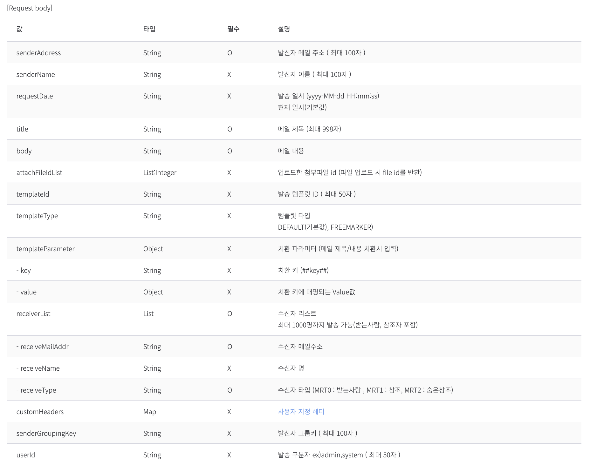

# 토스트 이메일 API

1. 일반메일발송
    - 템플릿 치환으로 발송할 예정
2. 만약 1~5번의 메일전송이 확정이라면 해당내용으로 예약메일을 발송할수없는지?
    - 중간에 결제가되거나 취소되면 모든 예약메일이 취소가되는지?
3. db를긁어서 발송 or Request Param에 DB정보가 포함
4. 발송 정보는 어느 DB에 넣을것인가?

## 일반메일

> URL

`(POST) /email/v2.0/appKeys/{appKey}/sender/mail`
appKey : String (고유 AppKey)

> Header

```ts
{
    "X-Secret-Key": "String"
}
```

> Request Body

- 필수값만 넣엇습니다.

```ts
{
    "senderAddress": String => 발신자 메일 주소 (MaxLength : 100)
    "title": String => 메일 제목 (MaxLength : 998)
    "body": String => 메일 내용
    "receiverList": [receiverListInterface] => {
        "receiverMailAddr": String => 수신자 메일주소
        "receiveType": String => 수신자 타입 (MRT0 : 받는사람, MRT1 : 참조, MRT2: 숨은참조)
    }
}
```

- 필수값 + 필수가 아닌값



> Response

```ts
{
    "header": {
        "resultCode": Integer => 실패 코드
        "resultMessage": String => 실패 메시지(사유)
        "isSuccessful": Boolean => 성공 여부
    },
    "body": {
        "data": {
            "requestId": String => 요청ID
            "results": [
                {
                    "receiveMailAddr": String => 수신자 메일 주소
                    "receiveName": String => 수신자 명
                    "receiveType": String => 수신자 타입 (MRT0 : 받는사람, MRT1 : 참조, MRT2: 숨은참조)
                    "resultCode": Integer => 수신자 발송 요청 결과 코드
                    "resultMessage": String => 수신자 발송 요청 결과 메시지.
                }
            ]
        }
    }
}
```

결제시 메일에 들어가야할것..?

결제시 -> 결제자 + 운전자..? 몇명한테 메일이가야하지

예약번호  : cst trl 번호 그대로 보내줘야하는지?  
유저네임 : driver_name  
핸드폰 : driver_phone  
예약상태 : 결제가 완료됐을경우에만 메일이 갈수있게 만듦  
취소 상태 : 취소요청,취소완료.. 취소실패등등 상세한 메일이 갈수있게  
결제 상태 : 결제가 완료된 상태면 환불 + 취소 , 결제가 미 완료된 상태면 취소내용만  
요금.. : 요금테이블 확인해서 분리하기  
쿠폰 : 사용한 쿠폰 (쿠폰정보)  

1. RDB에서 어느정도까지 데이터를 긁어올것인지? -> 예약번호만 받기때문에 전부 긁어야함
2. 긁어온후 전송된 결과는 어떻게 저장할것인지? -> 추후에 재전송이 용이하도록.. (운영툴등등)  
3. 전송시의 에러는 어떻게 처리할것인가?  
    1. 에러핸들링후, 재전송?
4. 다른 메일러들로 교체를 하더라도 바로 사용할수있게 도메인화
-> 근데 막상 다른 메일러들의 api가 잘안보임.. 보통 사용하는 규격대로 만들면되나?
5. 유효성검사는 어느정도까지? -> 예약번호만 받아오기때문에 검증해야함.
-> 결제애대한 검증?, 실제 결제됐는지? 결제과정중에 있는지? typeORM으로 get만하면될듯..? TypeORM 0.3버전에선 relation걸려있는 테이블도 select가능.. (같은 시리얼에는 제한적인 정보만 담겨있다.)
6. 템플릿만 바꿔끼워도 작동하게 만들기 -> 템플릿 k : v에 대응할수있도록.. getter들..

## 개발

AggregateRoot, Vo등 객체는 freeze시켜서 getter로만 접근 가능하게 (생성자 통째로 접근 no)

response? or void?